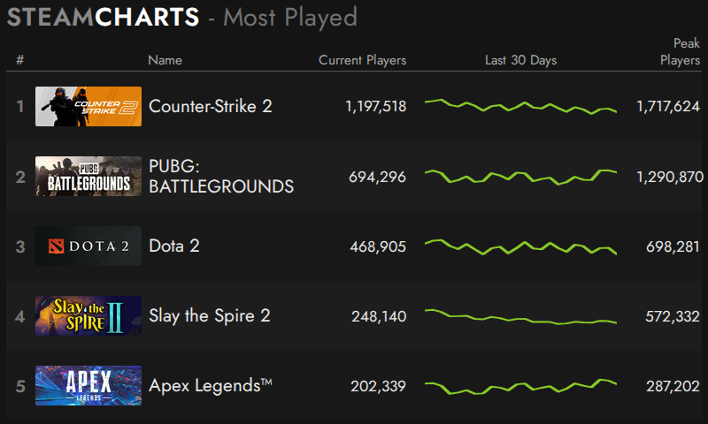
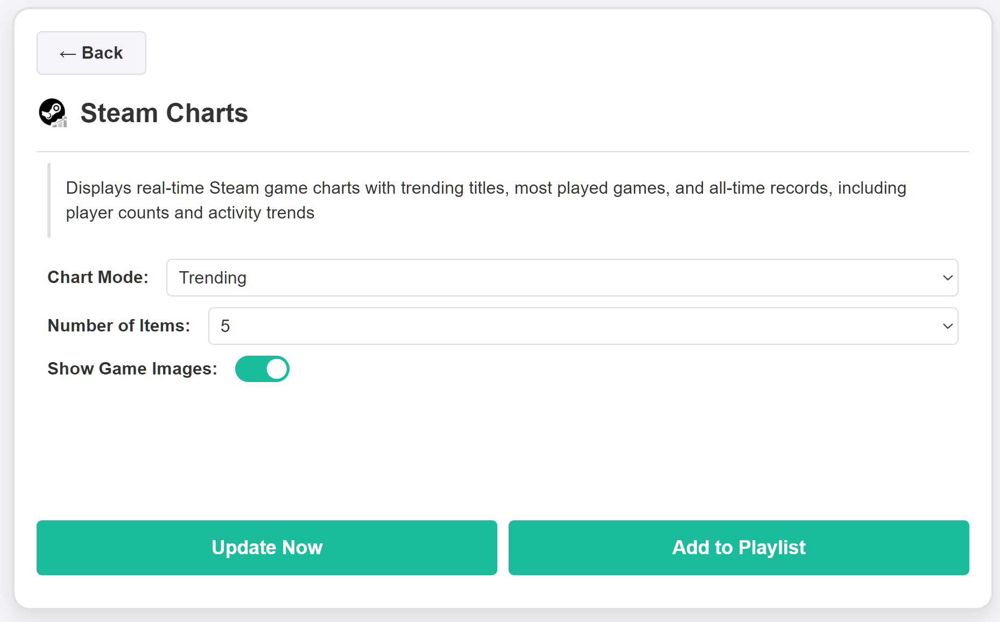

# Steam Charts Plugin for InkyPi

Steam Charts is a minimal and clean widget that displays real-time game statistics from Steam.

## Install

Install the plugin using the InkyPi CLI:

```bash
inkypi plugin install steam_charts https://github.com/saulob/InkyPi-Steam-Charts
```

This plugin is an extension for the [InkyPi](https://github.com/fatihak/InkyPi) e-paper display frame and includes the following features:

**Features**

- Displays most played games on Steam
- Shows current players and all-time peak records
- Trending games based on recent activity
- Optional game images
- Clean and minimal layout optimized for e-paper
- No API key required

**Settings**

- Mode selector:
  * Most Played
  * Trending
- Number of games to display
- Show game images (on/off)

**Details**

The plugin fetches data directly from steamcharts.com and presents it in a compact and readable format, ideal for e-paper displays with low refresh rates.

**UI / Result**

- List-based layout with game title and player count
- Optional thumbnails for visual context
- Trend indicators for player activity
- High contrast rendering suitable for e-paper
- Minimal spacing and optimized typography

**Notes**

- No external API required
- Data source: steamcharts.com
- Fully self-contained
- No breaking changes

**Screenshots**

<p align="center">
  
  
</p>
